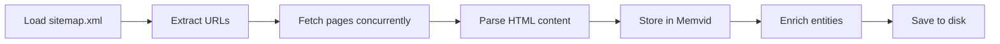

Memvid is Reze's knowledge base that enables RAG (Retrieval-Augmented Generation). The `populate_memvid.py` script fetches documentation from Resend.com and stores it for the agent to reference.

## Why Memvid?

Memvid gives Reze access to detailed Resend.com documentation, allowing the agent to:

- Answer questions about email API features
- Provide accurate parameter information
- Suggest best practices from official docs
- Reference error codes and troubleshooting steps

Without Memvid, Reze relies only on its base training data. With Memvid, it has up-to-date, specific knowledge about the Resend API.

## Quick start

<Steps>
  <Step title="Configure Memvid path">
    Set the path in your `.env` file:
    
    ```bash .env
    MEMVID_FILE_PATH=./memory.mv2
    MEMVID_INDEX_KIND=basic
    ```
  </Step>
  
  <Step title="Ensure sitemap exists">
    The script requires `scripts/sitemap.xml` containing Resend.com documentation URLs. This file should be included in the repository.
  </Step>
  
  <Step title="Run the population script">
    ```bash
    python scripts/populate_memvid.py
    ```
    
    This will:
    - Fetch all URLs from the sitemap
    - Parse documentation pages
    - Store content in Memvid
    - Create backups automatically
  </Step>
</Steps>

## How it works

The population script follows this process:



### Key features

- **Concurrent fetching**: Processes 10 URLs at a time for speed
- **Automatic backup**: Creates `.backup` files before modifications
- **Error recovery**: Detects corruption and restores from backup
- **Entity enrichment**: Runs rules-based entity extraction
- **Progress tracking**: Logs detailed progress information

## Script overview

The main components from `scripts/populate_memvid.py`:

### MemvidPopulator class

```python scripts/populate_memvid.py
class MemvidPopulator:
    """Populates Memvid with documentation."""

    def __init__(self):
        self.memvid_path: str = settings.memvid_file_path
        self.backup_path: str = self.memvid_path + ".backup"
        self.mem = None
        self.client = httpx.AsyncClient(
            timeout=30.0,
            headers={"User-Agent": "Mozilla/5.0 (Reze AI Agent)"},
            limits=httpx.Limits(max_connections=10, max_keepalive_connections=5),
        )
```

### Initialization

```python scripts/populate_memvid.py
async def initialize_memvid(self) -> None:
    """Initialize or load Memvid store."""
    logger.info(f"Initializing Memvid at {self.memvid_path}")

    if os.path.exists(self.memvid_path):
        logger.info("Loading existing Memvid store")
        self._create_backup()

        try:
            self.mem = use(
                kind=settings.memvid_index_kind,
                filename=self.memvid_path,
                enable_lex=True,
                enable_vec=False,
                mode="open",
            )
            logger.info("Memvid store loaded successfully")
        except Exception as load_error:
            # Handle corruption and recovery
            if self._attempt_recovery():
                logger.success("Memvid recovered successfully")
                return
            raise
    else:
        logger.info("Creating new Memvid store")
        self.mem = create(
            filename=self.memvid_path,
            kind=settings.memvid_index_kind,
            enable_lex=True,
            enable_vec=False,
        )
```

### Fetching and parsing

```python scripts/populate_memvid.py
async def fetch_and_store(self, url: str) -> bool:
    """Fetch URL and store in Memvid."""
    html = await self.fetch_page(url)
    if not html:
        return False

    parsed = self.parse_html(html, url)

    if not parsed["content"] or len(parsed["content"]) < 100:
        logger.warning(f"Skipping {url} - insufficient content")
        return False

    success = self.add_to_memvid(
        title=parsed["title"],
        content=parsed["content"],
        url=parsed["url"],
    )

    if success:
        logger.success(f"Added: {parsed['title']}")

    return success
```

### HTML parsing

```python scripts/populate_memvid.py
def parse_html(self, html: str, url: str) -> dict[str, str]:
    """Parse HTML and extract content."""
    soup = BeautifulSoup(html, "html.parser")

    # Remove scripts and styles
    for element in soup(["script", "style"]):
        element.decompose()

    # Extract title
    title_tag = soup.find("h1") or soup.find("title")
    title = title_tag.get_text(strip=True) if title_tag else "Untitled"

    # Find main content
    main_content = (
        soup.find("main")
        or soup.find("article")
        or soup.find("div", class_=lambda x: x and "content" in str(x).lower())
        or soup.find("body")
    )

    if not main_content:
        return {"title": title, "content": "", "url": url}

    # Extract and clean text
    text = main_content.get_text(separator="\n", strip=True)
    lines = [
        line.strip() for line in text.split("\n") 
        if line.strip() and len(line) > 10
    ]
    content = "\n".join(lines)

    return {"title": title, "content": content, "url": url}
```

### Adding to Memvid

```python scripts/populate_memvid.py
def add_to_memvid(self, title: str, content: str, url: str) -> bool:
    """Add document to Memvid."""
    try:
        self._create_backup()

        self.mem.put(
            title=title,
            text=content,
            metadata={
                "url": url,
                "source": "resend.com/docs",
                "length": len(content),
            },
        )
        return True
    except Exception as e:
        logger.error(f"Failed to add {title}: {e}")
        
        # Attempt recovery on corruption
        if self._attempt_recovery():
            # Retry after recovery
            try:
                self.mem.put(title=title, text=content, metadata={...})
                return True
            except Exception as retry_error:
                logger.error(f"Retry failed: {retry_error}")
        
        return False
```

## Running the script

### Basic usage

```bash
python scripts/populate_memvid.py
```

This processes all URLs from the sitemap with default settings:
- Concurrency: 10 simultaneous fetches
- No URL limit (processes all)

### Output example

```
================================================================================
Reze AI Agent - Memvid Population Script
================================================================================
Initializing Memvid at ./memory.mv2
Creating new Memvid store
Memvid stats: {'file_path': './memory.mv2', 'file_size': 0, 'file_size_mb': 0.0}
Populating Memvid with Resend.com documentation...
Loading sitemap from scripts/sitemap.xml
Found 127 URLs in sitemap
Processing 127 URLs with concurrency=10
Batch 1/13: Processing 10 URLs
Added: Introduction to Resend
Added: Sending Emails
Added: Email Status
...
Population complete! Added 124/127 documents
Final statistics:
Memvid stats: {'file_path': './memory.mv2', 'file_size': 4832000, 'file_size_mb': 4.61}
Enriching entities...
Entity enrichment complete
Memvid population complete!
Knowledge base saved to: ./memory.mv2
================================================================================
```

## Advanced configuration

### Limiting URLs

Modify the script to process fewer URLs during testing:

```python scripts/populate_memvid.py
await populator.populate_from_sitemap(
    max_urls=20,  # Only process first 20 URLs
    concurrency=10,
)
```

### Adjusting concurrency

Change concurrent fetch limit:

```python scripts/populate_memvid.py
await populator.populate_from_sitemap(
    max_urls=None,  # All URLs
    concurrency=5,  # Slower, more conservative
)
```

## Error handling

### Corruption detection

The script automatically detects Memvid corruption:

```python scripts/populate_memvid.py
def _attempt_recovery(self) -> bool:
    """Attempt to recover from corrupted Memvid file."""
    try:
        if os.path.exists(self.backup_path):
            logger.info("Attempting to restore from backup...")
            shutil.copy2(self.backup_path, self.memvid_path)

            try:
                self.mem = use(
                    kind=settings.memvid_index_kind,
                    filename=self.memvid_path,
                    enable_lex=True,
                    enable_vec=False,
                    mode="open",
                )
                logger.success("Successfully restored from backup")
                return True
            except Exception as e:
                logger.error(f"Backup also corrupted: {e}")
                return False

        logger.warning("No valid backup found, creating fresh Memvid store...")
        if os.path.exists(self.memvid_path):
            os.remove(self.memvid_path)

        self.mem = create(
            filename=self.memvid_path,
            kind=settings.memvid_index_kind,
            enable_lex=True,
            enable_vec=False,
        )
        logger.success("Created fresh Memvid store")
        return True
    except Exception as e:
        logger.error(f"Recovery failed: {e}")
        return False
```

### Automatic backup

Before each write operation, a backup is created:

```python scripts/populate_memvid.py
def _create_backup(self) -> None:
    """Create a backup of Memvid file."""
    try:
        if os.path.exists(self.memvid_path):
            shutil.copy2(self.memvid_path, self.backup_path)
            logger.debug(f"Created backup at: {self.backup_path}")
    except Exception as e:
        logger.warning(f"Failed to create backup: {e}")
```

## Statistics

After population, check the knowledge base size:

```python scripts/populate_memvid.py
async def get_stats(self) -> dict[str, Any]:
    """Get Memvid statistics."""
    try:
        file_size = (
            os.path.getsize(self.memvid_path)
            if os.path.exists(self.memvid_path)
            else 0
        )
        stats = {
            "file_path": self.memvid_path,
            "file_size": file_size,
            "file_size_mb": round(file_size / 1024 / 1024, 2),
        }
        logger.info(f"Memvid stats: {stats}")
        return stats
    except Exception as e:
        logger.error(f"Failed to get stats: {e}")
        return {}
```

<Note>
  A typical Memvid knowledge base with full Resend.com documentation is around 4-5 MB.
</Note>

## Troubleshooting

### Script fails with "sitemap not found"

Ensure `scripts/sitemap.xml` exists:

```bash
ls -la scripts/sitemap.xml
```

If missing, create it or download from the repository.

### Memvid file corruption

The script handles this automatically through backup restoration. If both the main file and backup are corrupted, the script creates a fresh store.

### Low success rate

If many URLs fail to fetch:
- Check network connectivity
- Verify URLs in sitemap are valid
- Reduce concurrency to avoid rate limiting

## Next steps

- Learn how Reze uses RAG in [conversation management](/guides/conversation-management)
- Configure Memvid settings in the [configuration guide](/guides/configuration)
- Test RAG by asking Reze about Resend API features
