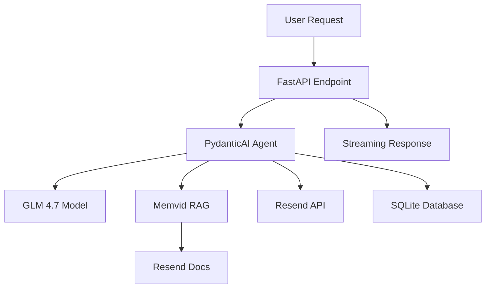

Reze AI agent is built with modern, production-ready technologies that enable real-time AI interactions, semantic search, and reliable email operations.

## Core technologies

### Backend framework

<Card title="FastAPI" icon="bolt" href="https://fastapi.tiangolo.com">
  High-performance async web framework with automatic API documentation and type validation
</Card>

**Version:** >= 0.104.0

- Async/await support for concurrent operations
- Automatic OpenAPI documentation at `/docs`
- Native streaming responses for real-time AI output
- Type-safe request/response validation

### AI and language models

<CardGroup cols={2}>
  <Card title="PydanticAI" icon="brain" href="https://ai.pydantic.dev">
    Type-safe AI agent framework with tool integration
  </Card>
  <Card title="GLM 4.7" icon="sparkles" href="https://open.bigmodel.cn">
    OpenAI-compatible language model from z.ai
  </Card>
</CardGroup>

**PydanticAI** (>= 0.1.0)
- Type-safe tool definitions
- Structured output validation
- Multi-turn conversation support
- Streaming response handling

**GLM 4.7**
- OpenAI-compatible API interface
- Hosted at `https://open.bigmodel.cn/api/paas/v4`
- Natural language understanding for email operations
- Context-aware responses with RAG integration

### Knowledge base and search

<Card title="Memvid SDK" icon="database" href="https://github.com/plastic-labs/memvid">
  Single-file AI memory system with hybrid search capabilities
</Card>

**Version:** >= 1.0.0

- Hybrid search combining BM25 (lexical) and semantic vectors
- Entity extraction with O(1) lookups
- Single `.mv2` file storage
- Automatic backup and corruption recovery
- Stores Resend.com documentation for RAG

<Info>
  Memvid enables the agent to answer questions about Resend.com features using semantic search over the official documentation.
</Info>

### Email service

<Card title="Resend API" icon="envelope" href="https://resend.com">
  Modern email API for developers
</Card>

- Send transactional emails via natural language
- Real-time delivery status tracking
- Attachment support
- Email listing and filtering

### Database

<CardGroup cols={2}>
  <Card title="SQLAlchemy" icon="layer-group">
    Async ORM with SQLite support
  </Card>
  <Card title="aiosqlite" icon="server">
    Async SQLite driver
  </Card>
</CardGroup>

**SQLAlchemy** (>= 2.0.0)
- Async/await database operations
- Type-safe ORM models
- Conversation history storage
- Username-based isolation

**aiosqlite** (>= 0.19.0)
- Asynchronous SQLite operations
- Default storage: `sqlite+aiosqlite:///./database.db`
- No external database server required

## Supporting libraries

### HTTP client

<Accordion title="httpx">
  **Version:** >= 0.25.0

  Modern async HTTP client used for:
  - Calling Resend.com API
  - Fetching documentation pages
  - OpenAI-compatible GLM API requests
  - Connection pooling and timeout management
</Accordion>

### Web scraping

<Accordion title="BeautifulSoup4">
  **Version:** >= 4.12.0

  HTML parsing library used in:
  - `scripts/populate_memvid.py` for documentation ingestion
  - Extracting main content from Resend.com docs
  - Cleaning and preprocessing text for RAG
</Accordion>

### Configuration and validation

<Accordion title="Pydantic">
  **Version:** >= 2.5.0

  Data validation using Python type hints:
  - Request/response schemas
  - Email address validation
  - API models with automatic validation
  - Settings management
</Accordion>

<Accordion title="Pydantic Settings">
  **Version:** >= 2.0.0

  Environment-based configuration:
  - Loads variables from `.env` file
  - Type validation for all settings
  - Default values with overrides
  - Validates URLs and email addresses
</Accordion>

### Logging

<Accordion title="Loguru">
  **Version:** >= 0.7.3

  Structured logging throughout the application:
  - Colored console output
  - Automatic exception tracking
  - Request/response logging
  - Debug information for troubleshooting
</Accordion>

### Server

<Accordion title="Uvicorn">
  **Version:** >= 0.24.0

  ASGI server with:
  - HTTP/1.1 and WebSocket support
  - Auto-reload in development mode
  - Configurable host and port
  - Production-ready performance
</Accordion>

## Development dependencies

Install with: `uv sync --dev`

<AccordionGroup>
  <Accordion title="pytest (>= 7.4.0)">
    Testing framework with async test support
  </Accordion>
  <Accordion title="pytest-asyncio (>= 0.21.0)">
    Async test fixtures and utilities
  </Accordion>
  <Accordion title="pytest-cov (>= 4.1.0)">
    Code coverage reporting with HTML output
  </Accordion>
  <Accordion title="ruff (>= 0.0.263)">
    Fast Python linter and formatter
  </Accordion>
</AccordionGroup>

## Python version

<Warning>
  Reze requires **Python 3.12 or higher** due to modern type hint syntax and async features.
</Warning>

```bash
python --version  # Should be 3.12+
```

## Architecture overview



## Related resources

<CardGroup cols={2}>
  <Card title="Installation" icon="download" href="/installation">
    Set up your development environment
  </Card>
  <Card title="Configuration" icon="gear" href="/guides/configuration">
    Configure API keys and environment variables
  </Card>
</CardGroup>